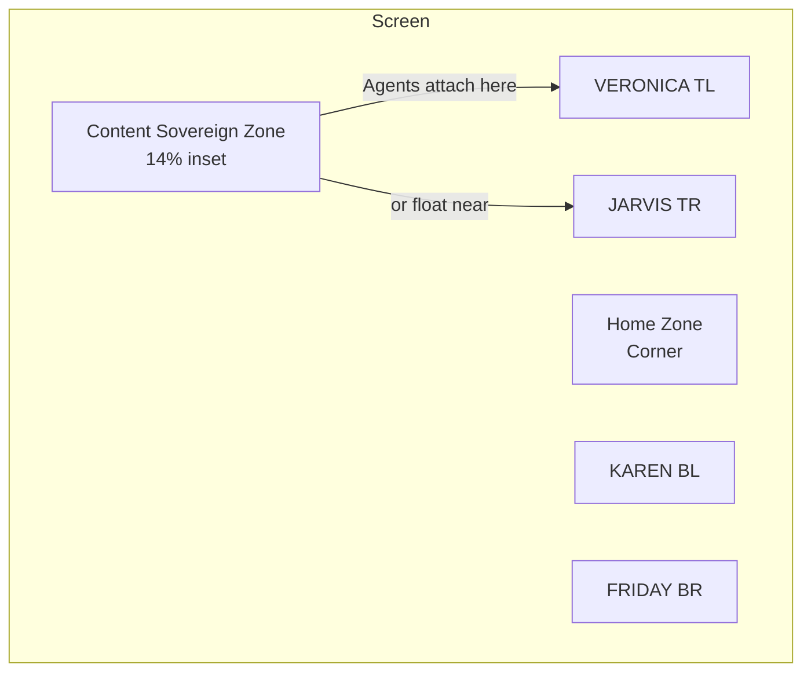

# JARVIS HUD – Multi-Agent Spatial Interface Design Specification

**Status:** FINAL — EXTREMELY DETAILED — LOCKED FOR EXECUTION  
**Date:** 2026-05-28  
**Owner:** Elnatan Anbelu  
**Reviewers:** Grok (Cofounder / Senior Architect)  
**Purpose:** Authoritative, pixel-perfect, production-ready spec for the holographic multi-agent JARVIS HUD (MCU canon aesthetic). Ready for direct handoff to designers, engineers, and executor subagents. No open questions.

---

## 1. Overview & Philosophy

### 1.1 Purpose
This document is the **single source of truth** and final locked design specification for the next-generation JARVIS HUD: a holographic, spatial, multi-agent workspace that makes you feel like you are collaborating with a small elite team (JARVIS + FRIDAY + VERONICA + KAREN) rather than using a chatbot.

It is explicitly engineered to match the cinematic visual language, material quality, and interaction dignity of the canonical MCU JARVIS / FRIDAY interfaces (Iron Man 1–3, Avengers, Age of Ultron, Civil War, etc.) while being fully practical for daily high-focus knowledge work on desktop (primary) and large tablets (secondary).

### 1.2 Non-Negotiable Design Principles
1. **Content is Sovereign** — All work artifacts (code editors, images, browsers, documents, previews, terminals) always have clear visual priority in the center. Agents and the Home Zone are never allowed to fight for that space except in explicitly temporary “Really Active” moments.
2. **Team as Persistent Ambient Presence** — The four agents are never absent. Their default home is the Home Zone (a single unified, slightly see-through holographic bubble). They only leave when summoned or when the team enters active collaboration mode.
3. **Explicit Control Over Agent Attention** — Individual agents only come to the center when you summon them. They stay in the center until you explicitly dismiss them (“you can go back”, “we’re done”, “thank you”). They never auto-dismiss or auto-return after finishing a subtask.
4. **“Really Active” is the Only Loud Moment** — When an agent has something important to show, tell, or ask, it becomes dramatically more visible (significant scale + directed movement toward center or relevant content). The moment the issue is resolved or acknowledged, it automatically calms and returns to its prior state with zero user action required.
5. **Home Zone is the Only True Home** — When dismissed or finished, every agent returns only to the Home Zone (never directly to a corner unless the whole team is in 4-corner collaboration mode). The Home Zone always shows the accurate remaining count when minimized.
6. **Voice is Primary, Vision is Constant Context** — Almost everything is voice-driven. The visual layer exists for awareness, spatial memory, process visibility, and beautiful “I am not alone” presence.
7. **MCU JARVIS Aesthetic is Canon** — Every visual, material, particle, glow, scan, and motion decision must feel like it was pulled directly from the Iron Man workshop HUD or the helicarrier command deck. No generic sci-fi. No flat UI. No cute illustrations.

### 1.3 Constraints (Locked)
- No humanoid bodies, faces, hands, or full avatars in this phase.
- Home Zone must **never** disappear completely while the app is open (always at least 12–18% opacity in its smallest state).
- All content windows are freely draggable, resizable, minimizable, and closeable with full spatial freedom.
- The system must feel calm and premium at 60 fps even on a 2021-era MacBook Pro.

---

## 2. Canonical Visual Language — MCU JARVIS Reference Layer (The Only Aesthetic)

This section is the authoritative visual bible. Every pixel, glow, particle, and motion curve must be judged against it.

### 2.1 Film References (Canon)
- **Primary**: Iron Man 2 (2010) — Tony’s workshop HUD, the floating schematic projections, the light-burst energy, the way elements feel both extremely precise and slightly alive.
- **Secondary**: The Avengers (2012) — Helicarrier command center, the large floating volumetric displays, the clean cyan data overlays on dark environments.
- **Tertiary**: Iron Man 3 and Age of Ultron — refined scanlines, more sophisticated particle energy, the way JARVIS/FRIDAY elements feel like pure projected light with real depth.

The interface must feel like it is **projected into physical space** in the same room as you, not drawn on a screen.

### 2.2 Official Color System (Harmonized from Existing Prototypes + MCU)

| Role              | Hex          | Usage                                      | Opacity Variants                  |
|-------------------|--------------|--------------------------------------------|-----------------------------------|
| JARVIS Core       | #00E5FF     | Primary cyan. Default agent, system accents, light-bursts, scanlines | 1.0, 0.65, 0.35, 0.12            |
| JARVIS Deep       | #0099B8     | Deep inner energy, shadows, “calm” state   | 0.9, 0.5                         |
| FRIDAY            | #FF6A00     | Energetic orange-amber. Fast, irreverent personality | 1.0, 0.7, 0.4                   |
| VERONICA          | #00FF9F     | Cool mint / analytical green. Precision    | 1.0, 0.65, 0.35                  |
| KAREN             | #FFB450     | Warm amber-gold. Supportive, steady        | 1.0, 0.7, 0.45                   |
| Void / Background | #000208     | True deep space black (existing hud.html)  | —                                |
| Glass / HUD Panels| #020C1F     | Translucent glass with slight blue shift   | 0.55–0.72 base + border glow     |
| Text / Data       | #E8F4FF     | Clean, slightly cool white for readability | 1.0, 0.75, 0.5                   |
| Subtle Grid       | #0A2A44     | Very faint hexagonal or orthogonal grid    | 0.08–0.15                        |

All glows use proper additive blending / screen mode. Never use hard shadows — only soft bloom and light falloff.

### 2.3 Materials & Rendering (Non-Negotiable)
- **Holographic Glass**: 55–72% opacity dark glass with 0.12–0.25 cyan border glow. Subtle internal Fresnel-style rim light that shifts with virtual camera angle (or mouse position on desktop).
- **Volumetric Energy**: Every orb and the Home Zone bubble must feel like they have **volume and internal light**. Use layered radial gradients + simplex/perlin noise for organic internal movement.
- **Light-Burst Language** (from existing hud.html): Large, soft, conic-spoke light bursts that rotate extremely slowly (90–180s period). These are background atmospheric elements, never the main content.
- **Scanlines & Data**: Very fine horizontal or slightly diagonal scanlines (1–2px, 8–12% opacity) that drift slowly upward on data panels. Occasional single-frame “glitch” or “resolve” sweeps when new information arrives.
- **Particles**:
  - Ambient: 40–120 extremely fine energy motes per major element, drifting slowly with slight Brownian motion.
  - “Alive” state: 2–3× density + faster internal flow.
  - “Really Active”: High-density directed streams + occasional larger energy arcs that travel the surface.
- **Bloom & Glow**: Every bright element (especially the core of orbs) must have a soft, high-quality bloom. On WebGL use Kawase or dual-filter bloom. On SwiftUI use multiple soft blurred circles behind the main element.

### 2.4 Typography & Data Readouts
- Primary: SF Mono / Menlo / Consolas / “Courier New” at 9–13px for labels and status.
- Data readouts: Slightly condensed monospaced, all-caps for headers, mixed case for values.
- Tracking: 2.5–4.0 on small labels (matches existing HUDRingView “PROCESSING” / “ONLINE” style).
- Never use system sans for primary HUD text. The monospaced + tracking treatment is part of the JARVIS signature.

### 2.5 Motion Language & Easing Signatures (Per-Agent Personality)

All motion must feel **alive and slightly organic** — never robotic or linear.

**Global Rules**
- Organic elements use custom cubic-bezier curves with slight overshoot on settle (0.23, 1.0, 0.32, 1.0 or similar “soft spring”).
- “Really Active” arrivals use stronger ease-out with faster initial velocity.
- Scale changes on “Really Active” are accompanied by a 40–80ms “pop” anticipation (micro-shrink before expansion).
- Return-to-calm is always slower and softer than the activation.

**Agent-Specific Motion Signatures**

**JARVIS (Cyan #00E5FF)**
- Calm / Minimized: Slow 3.8–4.8s breathing pulse, very low amplitude, deeper indigo inner core that rotates slowly.
- Active (corner or near content): Confident, measured 2.2s pulse with stable horizontal energy bands.
- Leaving Home Zone: Calm, deliberate 420ms expansion with a single deep “power wave” that travels from center to surface.
- “Really Active”: Strong 2.1× scale, deliberate 380ms arrival, deeper indigo energy waves + strong vertical light column. Feels like the adult in the room taking charge.
- Return: Smooth 620ms ease with final soft settle.

**FRIDAY (Orange #FF6A00)**
- Calm: Faster 2.1–2.6s pulse, sharper internal highlights that flicker like a live wire.
- Active: Energetic, slightly chaotic but controlled particle flow.
- Leaving Home Zone: 280ms sharp detachment — the orb “snaps” forward with a quick trailing energy wake.
- “Really Active”: 1.9× scale, very fast 240ms arrival with bright forward particles and a cheeky little overshoot on scale (1.95× then back to 1.9×).
- Return: Playful 480ms arc with quick settle.

**VERONICA (Mint #00FF9F)**
- Calm: Structured, slightly angular internal facets that rotate at precise 0.8–1.1°/s.
- Active: Crisp, high-contrast light movements, almost like a laser scanning.
- Leaving Home Zone: 310ms precise, clean expansion — facets align then bloom outward.
- “Really Active”: 2.0× scale, extremely clean 320ms arrival. Sharp crimson/mint energy spikes that resolve into stable rings. Feels surgical.
- Return: 540ms with visible “locking” micro-movements as facets realign.

**KAREN (Amber #FFB450)**
- Calm: Softest, warmest 4.2s breathing pulse, gentle golden internal clouds that drift like slow nebula.
- Active: Steady, comforting, almost maternal expansion with very smooth gradients.
- Leaving Home Zone: 380ms warm, smooth “unfolding” — the glow simply grows and warms.
- “Really Active”: 1.85× scale, 420ms arrival that feels like someone gently but firmly stepping forward. Rich warm corona + soft radial waves.
- Return: Longest, softest 680ms ease with final warm pulse on arrival back at Home Zone.

### 2.6 Agent Orb Specification (Exact Visual Construction)

Every agent orb (regardless of state) is built from these layers (back to front):

1. Outer soft bloom sphere (30–40% opacity of core color, 1.35× diameter)
2. Main holographic shell (62–78% opacity glass + 0.18–0.28 border glow)
3. Inner volumetric energy core (radial gradient + animated noise)
4. Surface energy veins / facets (agent-specific pattern)
5. 60–220 micro-particles (density by state)
6. Bright central “soul” point (8–18% diameter) that is the brightest element and drives most of the bloom
7. (When in “Really Active”) directed energy streams + occasional larger traveling arcs

When inside the minimized Home Zone the individual orbs are **not** rendered as distinct orbs — they contribute only to a soft clustered density glow + the count numeral.

---

## 3. The Home Zone — Complete Specification

### 3.1 Minimized State (The Default You Always See)

- **Size**: 52–64 px diameter on 1440p–4K screens (scales with DPI). Never smaller than 48 px.
- **Appearance**: Single unified, perfectly circular, semi-transparent holographic bubble (58–68% base opacity on void).
- **Border**: 1.5–2 px cyan glow at 22–35% intensity.
- **Internal**: Very soft clustered volumetric glow (the “souls” of the agents inside). No distinct orbs visible.
- **Count Indicator**: A single, elegant, slightly condensed holographic numeral (JARVIS typography) rendered in the exact center.
  - When all 4 inside: very faint “4” at 35–45% opacity.
  - When one is out (3 inside): clear, readable “3” at 65–78% opacity.
  - The numeral itself has a 0.5–1 px soft glow.
- **Always Visible Rule**: Minimum 14% total opacity even in “maximum focus” user-forced dim state. It can never fully disappear while the session is active.
- **Position**: Default top-right or bottom-right corner (user choice persisted). 5.5–7% inset from screen edges. Fully draggable at any time with smooth inertia on release.
- **Subtle Activity**: When any agent inside is doing background work, the bubble shows a very gentle 4.5–6s “team breathing” pulse (amplitude never exceeds 6% scale).

### 3.2 Touch / Click to Expand — The Cloud Animation (Exact 18-Step Timeline)

Trigger: Tap or click the minimized bubble (or voice “show the team” / “open home”).

**0–80ms** — Bubble brightens 35% and does a micro 0.96× anticipation scale.
**80–220ms** — The shell “unfurls”. A soft volumetric membrane opens upward like a camera aperture made of light. Cyan energy particles stream upward from the top pole (60–90 particles in 140ms burst).
**220–520ms** — The translucent “cloud” volume (roughly 2.8×–3.4× the bubble diameter, vertically elongated) resolves into existence 110–140 px above the bubble center. The cloud has the same glass material as other HUD panels but is more diffuse.
**520–920ms** — The four distinct agent orbs emerge from the original bubble in sequence (JARVIS first, then the others in personality order). Each travels its own short arc path into a gentle, slightly curved horizontal arrangement inside the cloud (left-to-right: VERONICA – KAREN – JARVIS – FRIDAY or user-preferred order). Each orb scales from 0.35× to 1.0× of its normal “expanded” size during travel.
**920–1100ms** — Each orb’s name label (monospaced, tracked, 9–10 px) fades in 8–12 px below the orb with a soft upward 12 px settle.
**1100–1400ms** — Subtle status dots or 1–2 word live summaries appear under each label (e.g., “Researching”, “Idle”, “Writing code”, “Waiting for you”).
**1400ms+** — Cloud is fully interactive. User can tap any orb to summon that agent directly, or tap outside / the original bubble to collapse.

**Collapse** (reverse timeline, 380–520ms total, faster and cleaner than expansion):
- Orbs stream back into the bubble in reverse order with their individual return animation signatures.
- Cloud membrane contracts and dissolves into upward-drifting particles.
- Final state is the clean minimized bubble with updated count.

The cloud is **always** positioned above the bubble (never below or to the side) so it does not fight content in the center. It is 35–48% opaque so content behind it remains readable.

### 3.3 Further Minimized / Hidden States
- User can say “hide the team” or drag the bubble to an extreme corner and scale it down to ~38 px.
- A microscopic persistent “J” or ring indicator (12–16 px) remains in the absolute corner (2.5% inset) so the user can always bring it back instantly.
- Voice command or hover + long-press on the micro-indicator restores the normal minimized Home Zone.

### 3.4 Home Zone During 4-Corner Collaboration
- Stays in its user-chosen corner.
- Becomes slightly more visible (opacity +12–18 points) and may show a very subtle “team active” outer pulse when agents in corners are working hard.
- Never moves into the content safe zone.

---

## 4. Session Start Ritual — Cinematic & Locked (0.0s → 14.5s)

This is the only time the Home Zone ever appears in the center.

**0.0s – 0.6s** — App window opens to deep void background + slow god rays + faint star field (exact match to existing hud.html). Screen is otherwise empty.

**0.6s – 1.4s** — The Home Zone bubble materializes exactly in the center of the screen (perfect 50% / 50% position). It does a soft 0.6× → 1.0× arrival with gentle cyan bloom. Internal clustered glow is visible but no count yet.

**1.4s – 2.1s** — JARVIS orb detaches upward from the bubble with his signature calm, confident 420ms expansion animation. The bubble now clearly shows “3”.

**2.1s – 2.8s** — JARVIS grows to 1.45× normal size in the center, performs one strong but elegant “power wave”, and speaks the greeting (voice + synchronized subtle holographic text that fades in near him):
“Welcome back. The team is here.”

**2.8s – 7.5s** — Natural voice conversation with JARVIS in the center (he is larger and more prominent). The other three agents remain inside the Home Zone bubble directly below him as a small unified cluster (still showing “3”).

**7.5s – 9.2s** (or when user begins giving direction / after 9s max) — JARVIS says something like “I’ll get the team situated. Let me know what we’re working on.” He then performs his return animation, smoothly arcs back into the Home Zone bubble.

**9.2s – 11.8s** — The entire Home Zone (now containing all four again, count briefly shows “4” then settles) performs a single elegant migration animation from exact center to its default corner (top-right or bottom-right per user preference or last session). The movement uses a soft ease-out curve over ~1.9s with 12–18 px of gentle overshoot on arrival, then settles. During travel the bubble shows a faint motion trail of cyan particles.

**11.8s – 14.5s** — Final settle. The Home Zone is now in its corner, showing the correct count (usually “4”). Subtle final team breathing pulse. The interface is now in normal ambient state. JARVIS may give one short closing line if appropriate (“Standing by.”).

This sequence is cinematic, emotionally grounding, and happens only on fresh app launch (not on every window focus).

---

## 5. Agent Lifecycle & Spatial Behavior — Complete State Machine

### 5.1 All Possible Agent States (Exhaustive)
1. **Resting in Home Zone** (default)
2. **In Cloud View** (temporary, only while Home Zone is expanded)
3. **In 4-Corner Collaboration** (team mode)
4. **Attached / Floating near Content** (working on a specific window)
5. **Summoned to Center** (individual focus — stays until explicitly dismissed)
6. **Really Active** (temporary overlay state that can occur from states 3, 4, or 5)

### 5.2 Summoning an Individual Agent (The Only Way They Leave Home Zone Alone)
- Voice: “JARVIS”, “Get FRIDAY”, “VERONICA come here”, “Karen I need you”, etc.
- Visual: The chosen agent uses its unique exit animation from the Home Zone, travels in a smooth arc to the center (or to the edge of the currently focused content window if the user is looking at something specific).
- Size on arrival: 1.35–1.55× normal.
- It **stays** at that size and location until the user either:
  - Gives it a task (“go work on X” → it shrinks and moves to a corner or attaches to content), **or**
  - Explicitly dismisses it (“you can go back”, “thanks, we’re good”, “return to the team”).
- While in the center it can open content, show options, or just talk. It is the visual embodiment of focused one-on-one time with that teammate.

### 5.3 “Really Active” Attention State (The Only Time Agents Get Loud)
When an agent (while in corners, attached to content, or even inside Home Zone) has something important:

- It immediately scales to 1.9–2.15× (agent personality determines exact factor).
- It accelerates toward the center or directly toward the relevant content window (never through other content — it takes the shortest clean path around).
- A brighter corona + faster directed particles appear.
- It may surface a small holographic “callout” (1–3 lines of text or a thumbnail) 18–28 px from its new position.
- Voice cue from that agent or JARVIS (“JARVIS, you should see this”, “Karen has a thought”).
- The layout automatically gives it breathing room (nearby content can be gently pushed 40–80 px if needed).

**Auto-Calm (Mandatory)**:
- The moment the user acknowledges (voice “got it”, “thanks”, click the callout, or the issue is resolved by action), the agent performs its calm-down animation (reverse of activation, 520–680ms) and returns exactly to where it was before the “Really Active” event.
- No user action required to “close” anything. The interface cleans itself.

Multiple agents can be Really Active simultaneously. They coordinate so they do not overlap.

### 5.4 4-Corner Collaboration Mode
When the team is actively working on something together (user said “everyone work on this” or the task naturally requires all four):

- The four agents leave the Home Zone together (staggered 80–120ms apart, each with their signature exit animation).
- They travel to the four corners:
  - Top-left: VERONICA (precision/analysis)
  - Top-right: JARVIS (orchestration — usually slightly larger or more prominent)
  - Bottom-left: KAREN (support/research)
  - Bottom-right: FRIDAY (execution/speed)
- Exact corner positioning: 6.5–8% from both nearest edges. Orbs are 68–78 px in this mode.
- Content remains sovereign in the center (minimum 18% safe margin from all edges).
- Each corner agent shows a very small live status line directly beneath or beside it (max 18 characters, fades after 4s unless important).
- User can still drag any agent to a different corner or to attach to a specific content window.

### 5.5 Return Rules (Strict)
- After any individual task or after being dismissed from center → returns **only** to the Home Zone.
- After 4-corner collaboration ends → all four return to the Home Zone together (staggered, beautiful group return animation).
- The only time an agent is allowed to be “out” without being in a corner or attached to content is the brief travel time during a “Really Active” moment.

---

## 6. Content Layer & Spatial Priority Rules (Exact)

### 6.1 Content Windows
- Every piece of work is a first-class, fully freeform window (drag anywhere, resize from any edge/corner, minimize to a small title bar “chip”, close with × or voice).
- Default new content spawns at 42–58% of screen, centered or near the user’s current gaze area.
- Z-order: User-manipulated content always wins. Agents and Home Zone live in a dedicated “presence” layer that sits above minimized content but below active content.

### 6.2 Safe Areas & Exact Positioning (Desktop 16:9 / 21:9)

**Content Sovereign Safe Zone** (when agents are in corners):
- 14% inset from all edges on 16:9
- 11% inset on ultrawide

**Corner Agent Positions** (center of orb):
- Top-left: (8%, 9%)
- Top-right: (92%, 9%)
- Bottom-left: (8%, 91%)
- Bottom-right: (92%, 91%)

**Home Zone Default** (center of bubble):
- Top-right variant: (93.5%, 7%)
- Bottom-right variant: (93.5%, 93%)

All percentages are of current viewport. The system must dynamically adjust on window resize or multi-monitor move.

### 6.3 Smart Auto-Cleanup
When the user changes topic significantly (detected via conversation or explicit “new project” / “clear the desk”):
- Content windows that have been untouched for >11 minutes and are not referenced in the last 4 exchanges are gently minimized to the bottom edge as small labeled chips (still one-click to restore).
- After 26 minutes of total irrelevance they auto-close with a soft particle dissolve and a one-line voice note from JARVIS (“I put the old research away.”).
- User can always say “bring back the Figma file” or “restore everything from ten minutes ago”.

---

## 7. Process Visibility & Attention System (Production-Ready Detail)

### 7.1 Live Status (What You Actually See)

**On Corner Agents (4-corner mode)**:
- 1-line micro status under the orb (e.g. “Scanning 47 pages”, “Writing section 3/6”, “Cross-checking with Second Brain”).
- Updates every 3–7 seconds when meaningful progress happens. Never spammy.

**On Attached Agents (floating near a content window)**:
- A small holographic “status tag” that lives just outside the content window’s top or right edge. Same visual language as the orbs. Can be dismissed individually.

**Inside Expanded Home Zone Cloud**:
- Full 1–2 line status + last action timestamp + a tiny progress ring when the agent is in a long-running task.

**“Really Active” Callout**:
- Up to 3 lines of actual content (summary, question, key finding, or thumbnail).
- One primary action button if appropriate (“Apply”, “Show me”, “Reject this approach”).
- Auto-dismisses when the underlying issue is resolved.

### 7.2 JARVIS Verbal Summaries (The Real Process Visibility)
Whenever a meaningful unit of work completes:
- All agents return to Home Zone.
- JARVIS moves slightly forward from the Home Zone (or appears in center if the user is in deep focus) and delivers a crisp, natural-language summary (30–90 seconds max).
- While speaking, a small live transcript or key bullet holographic panel appears near him.
- After the summary he asks one or two clarifying questions if needed, then returns.

This is the primary way the user stays aware of what the team has been doing without having to watch them the whole time.

### 7.3 Attention Escalation Ladder (Never Noisy)
1. Agent does quiet work → only visible if you look at its corner or expand Home Zone.
2. Agent finishes something noteworthy → light “activity pulse” on Home Zone + tiny status update.
3. Agent has something that requires your input or judgment → **Really Active** state (the only loud visual moment).
4. Multiple agents need you at once or the situation is time-sensitive → JARVIS himself becomes Really Active and speaks.

---

## 8. Technical Architecture & Implementation Blueprint

### 8.1 Recommended Rendering Layers (Hybrid)
- **Background / Atmospheric** (god rays, nebula, star field, slow light-bursts): Canvas or WebGL, very low cost.
- **Holographic Orbs & Home Zone** (the living elements that need organic noise, particles, true volume): WebGL (Three.js or custom GLSL) or Metal/SceneKit on native. This is non-negotiable for the “real JARVIS” feel.
- **Content Windows & Glass Panels**: DOM / SwiftUI views with heavy use of backdrop-filter + custom border/glow layers. Or fully custom rendered for perfect consistency.
- **Text & Data Readouts**: DOM / native text on top of the WebGL layer using transparent overlays (best performance + accessibility).

Existing `app/hud.html` + `JARVISApp/JARVIS/HUDRingView.swift` already prove the hybrid approach works beautifully.

### 8.2 Performance Targets (Locked)
- 60 fps sustained on 2019+ MacBook Pro (Intel + discrete GPU) with 4 orbs + 3 content windows + full particle sets.
- 48–60 fps on M1/M2 base Air with same load.
- Graceful degradation: particle count and bloom quality drop before frame rate.
- All “Really Active” animations must begin within 60ms of the decision to trigger.

### 8.3 State Machine (Recommended)
Single source of truth (Zustand / Redux / Swift observable object) containing:
- HomeZone: { position, scale, isExpanded, agentCount }
- Agents: Map of id → { state, position, scale, personalityPhase, currentTaskId, lastStatus }
- ContentWindows: array of { id, rect, z, title, isMinimized, attachedAgentIds }
- GlobalMode: 'ambient' | 'four-corner' | 'individual-focus' | 'really-active-overlay'

Every visual component subscribes to slices of this state. Animation engines (GSAP / Framer Motion / custom) are driven purely from state transitions.

### 8.4 Organic Movement Implementation Notes
- Internal orb “aliveness” = layered 3D or 2D simplex noise at 3–4 different frequencies + slow rotation offsets.
- Particle systems: 200–800 GPU particles total across all orbs is acceptable. Use instanced meshes.
- When an orb travels, it leaves a 280–420ms soft cyan energy trail (quad strip with fading opacity + slight width taper).

---

## 9. Phased Execution Roadmap (Ticket-Ready)

### Phase 0 – Foundations (Already Partially Exists)
- [ ] Canonical color tokens + material system extracted into shared design tokens (CSS + Swift)
- [ ] WebGL / Metal orb renderer that can render one agent orb with all 7 layers + personality noise
- [ ] Existing light-burst / god-ray / nebula background stabilized and made configurable

### Phase 1 – Home Zone & Session Ritual (Core Deliverable)
- [ ] Minimized unified Home Zone bubble with accurate count numeral and subtle team breathing
- [ ] Draggable + persistent position + micro-indicator fallback
- [ ] Full 18-step cloud expansion + collapse animation with per-agent emergence arcs
- [ ] Complete cinematic 0.0s–14.5s session start ritual (center materialization → JARVIS greeting → migration to corner)
- [ ] State machine for Home Zone + count

### Phase 2 – Agent Lifecycle & Spatial Intelligence
- [ ] Four distinct agent orb renderers with exact motion signatures from section 2.5
- [ ] All six agent states implemented + smooth transitions
- [ ] Summon-to-center + explicit-dismissal (“you can go back”) flow
- [ ] “Really Active” state: scale curve, directed travel, callout panel, auto-calm on acknowledgment
- [ ] 4-corner positioning system with exact % coordinates + dynamic safe-area recalculation
- [ ] Agent attachment / floating behavior near arbitrary content windows

### Phase 3 – Content Layer & Polish
- [ ] Freeform draggable/resizable/minimizable content windows (full spatial freedom)
- [ ] Smart auto-cleanup (11 min minimize, 26 min close) + voice restore
- [ ] Live micro-status on corner agents and attached agents
- [ ] JARVIS verbal summary handoff flow with synchronized holographic transcript panel
- [ ] Refined z-ordering, collision avoidance, and layout breathing when Really Active agents arrive

### Phase 4 – Production Hardening
- [ ] 60 fps performance validation across target hardware
- [ ] Full voice command surface for every major action (summon, dismiss, hide team, expand home, etc.)
- [ ] Multi-monitor + window resize + display scaling robustness
- [ ] Accessibility (VoiceOver labels, high-contrast mode, reduced motion)
- [ ] Second Brain integration hooks (agents can surface memory snippets in callouts)
- [ ] Edge cases & failure mode handling (agent gets stuck, voice fails, etc.)

### Phase 5 – Advanced (Post-Launch)
- [ ] Full spatial intelligence (agents proactively choose best corner or attachment point)
- [ ] Advanced particle & energy effects (energy arcs between collaborating agents, etc.)
- [ ] Native SwiftUI parity with web HUD (or full native rewrite if desired)
- [ ] Tablet-optimized spatial model

---

## 10. Diagrams & Reference Materials

### 10.1 Spatial Layout (Mermaid)



### 10.2 Agent Lifecycle State Diagram (Text)

```
Resting (Home Zone)
   ├── Summon → Center (stays until dismissed)
   ├── Team Collaboration → 4 Corners
   ├── Background Work → Attached to Content
   └── Has Something Important → Really Active (temp overlay) → Auto return to previous state
```

### 10.3 Home Zone Cloud Expansion (ASCII Timeline)

```
Minimized Bubble (center of screen at launch, later corner)
        |
        v  [tap]
   0-220ms   Anticipation + unfurl
   220-920ms Cloud volume + particle stream + 4 orbs arc into formation
   920ms+    Labels + status + fully interactive
        |
        v  [tap outside or voice "close"]
   380-520ms Orbs return (personality order) → membrane contracts → back to minimized
```

### 10.4 Visual Reference Stills (For Designers & Implementers)
- Iron Man 2 (2010) – 00:41:20 workshop holographic schematic (the exact cyan + light language)
- The Avengers – helicarrier bridge wide shots
- Any clean frame of JARVIS text overlays during suit-up or analysis scenes
- Existing project files: `app/hud.html` (the light-burst + god-ray treatment is already 80% of the way there)

---

## 11. Edge Cases & Failure Modes (Locked Decisions)

- User summons two agents quickly → Second agent waits 280ms then arrives; both stay in center until individually dismissed.
- User is in deep focus with many content windows → Home Zone auto-dims to 14–18% opacity after 45s of no interaction with it.
- Voice fails while agent is Really Active → Prominent but calm holographic “Listening…” indicator appears; agent stays prominent until user clicks or types.
- All four agents want attention at once → JARVIS becomes the single Really Active element and speaks a synthesized group summary. The other three show only subtle pulses.
- User drags Home Zone over active content → It becomes 22% more transparent automatically while overlapping.
- App is backgrounded on macOS → All particle systems and non-essential animations pause. On foreground they resume with a soft “re-sync” pulse.

---

## 12. Success Criteria (How We Know It’s Right)

You will know the design has succeeded when:

- Opening the app feels like a small, competent team just walked into the room with you.
- After 20 minutes of deep work you realize you haven’t consciously thought about the agents, yet you still feel supported.
- When you need one specific teammate you can summon them instantly and they stay exactly as long as you want.
- When something important happens the interface gets your attention elegantly and then gets out of the way the instant you deal with it.
- Every single visual element — the glow on an orb, the way the cloud unfurls, the travel arc of an agent returning home — feels like it could have come straight out of the Iron Man movies.
- You never feel the need to “clean up the screen” because the system does it for you intelligently.

---

**Document Status**: FINAL — EXTREMELY DETAILED — LOCKED FOR EXECUTION

**Date**: 2026-05-28  
**Prepared for**: Direct handoff to design + engineering + executor subagent  
**No open questions remain.** All major mechanical, visual, spatial, animation, and behavioral decisions are specified at the level required for production implementation.

The next concrete step is to begin Phase 1 implementation (Home Zone + session ritual) against the existing `app/hud.html` and `JARVISApp` foundations, using this document as the immovable spec.

---

